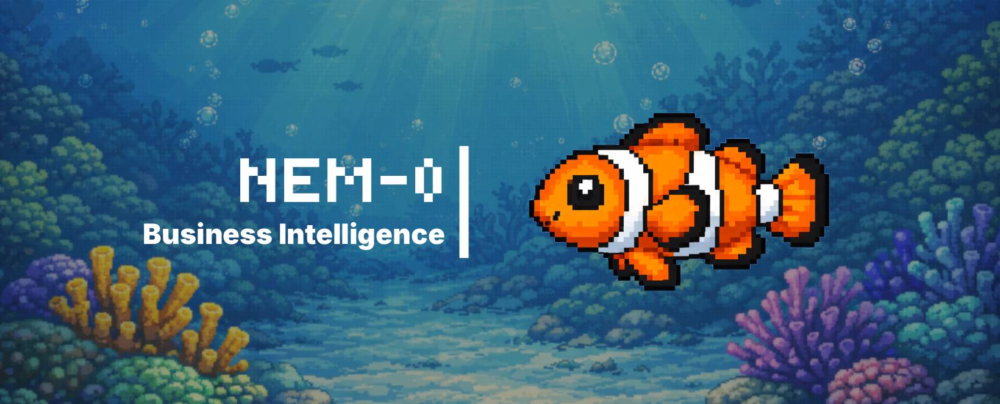

# Nem-0

> You: Hello, my name is *** and an I am an AI builder. 
> 
> Nem-0: Hello ***. What can I help you with today?
>
> You: I am currently struggling with xyz problem in my business. Here are some xyz ideas. 
>
> Nem-0: Ok...you're absolutely right...
>
> You: ...
>

Nem-0 is a business intelligent AI agent with long-term memory. This application will serve small business owners with a very knowledgable business advisor. This agent will hold context as everything will be stored in a database that will contain the vast sea of knowledge of your business. No need to remind your agent or provide context as memories will serve that information.

## How its made: 

Tech Stack: 
- Frontend: Vite + React + Tailwindcss
- Backend: FastAPI + Mem0
- Database: Supbase
- OpenAI API

## AI first development: 
  
## Optimizations

## Lessons Learned

## How to run Nem-0
