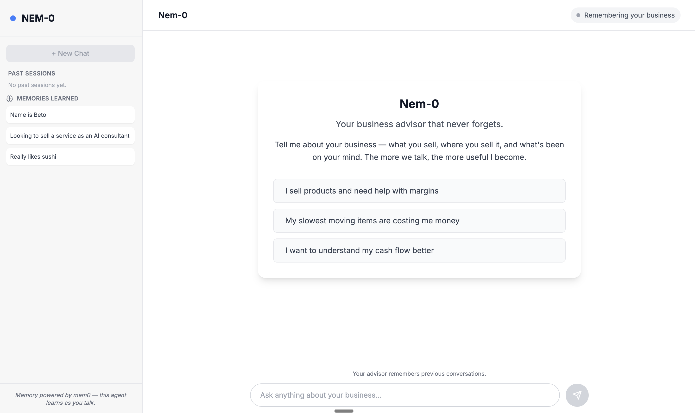

# Nem-0


> You: Hello, my name is *** and an I am an AI builder.
>
> Nem-0: Hello ***. What can I help you with today?
>
> You: I am currently struggling with xyz problem in my business. Here are some xyz ideas.
>
> Nem-0: Ok...you're absolutely right...
>
> You: ...
>

Nem-0 is an AI-powered business advisor agent with long-term memory, built for small business owners who need a knowledgeable, always-available advisor at their side. Unlike typical AI chat tools, Nem-0 remembers everything; your business history, goals, challenges, and decisions are all stored and recalled automatically. No need to re-explain your situation every session. Nem-0 picks up right where you left off.

## How its made:

Tech Stack:
- Frontend: Vite + React + Tailwindcss
- Backend: FastAPI + Mem0
- Database: Supabase
- OpenAI API

## AI First Development
- Started from [Vega](https://github.com/rcm-webdev/vega-autonomous-ai-agent) as a foundation and extended it into a memory-enabled AI agent
- Referenced Mem0 docs and collaborated with Claude Code to scaffold the FastAPI backend
- Used [Bolt.new](https://bolt.new/) to rapidly prototype the frontend, choosing Vite + React over Next.js for simplicity
- Added a validation layer to guard against prompt injection and SQL injection, since the LLM is directly connected to a database



## Optimizations
- Add authentication so the app can be deployed for multiple users in a production environment. Currently each user clones the repo and uses their own keys.
- Build a session/folder system to organize and revisit past conversations.
- Explore Mem0's managed cloud mode as an alternative to self-hosting memory on Supabase, to reduce infrastructure overhead.

## Lessons Learned
- Running the FastAPI backend and Vite frontend concurrently with `concurrently` (via a single `npm run dev` command) significantly improved the development workflow.
- Mem0 in self-hosted mode requires your own LLM and vector store. OpenAI handles embeddings and completions while Supabase stores the vectors. No Mem0 API key needed for this current build.
- Fine-tuning the agent prompt with realistic small business scenarios (cash flow, inventory, revenue goals) was critical to getting useful, grounded responses instead of generic advice.

## How to run Nem-0

### Prerequisites
- Python 3.10+
- Node.js 18+
- A Supabase project with a Postgres database
- An OpenAI API key

### 1. Clone the repo

```bash
git clone https://github.com/your-username/nem-0.git
cd nem-0
```

### 2. Set up environment variables

Create a `.env` file in the project root:

```env
SUPABASE_URL=your_supabase_project_url
SUPABASE_KEY=your_supabase_anon_or_service_key
DATABASE_URL=your_postgres_connection_string
OPENAI_API_KEY=your_openai_api_key
MODEL_CHOICE=gpt-4o
```

### 3. Install backend dependencies

```bash
python -m venv .venv
source .venv/bin/activate
pip install -r requirements.txt
```

### 4. Install frontend dependencies

```bash
npm install
npm --prefix nem0 install
```

### 5. Run the app (frontend + backend concurrently)

```bash
npm run dev
```

This starts:
- FastAPI backend on `http://localhost:8000`
- Vite + React frontend via `npm --prefix nem0 run dev`

# Related Projects
[](https://github.com/rcm-webdev/mamm0th)
[](https://github.com/rcm-webdev/vega-autonomous-ai-agent)
